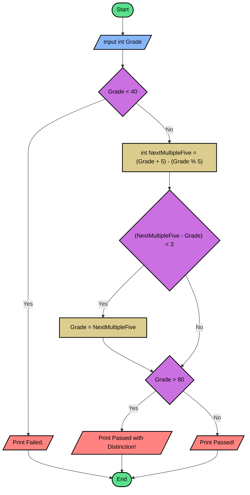

## Problem 1
This program will request a student's grade from the user. 
Depending of the grade, will delivery a message "Failed", either "Passed with Distinction" or "Passed".

## Flowchart

## Pseudo code
```basic
READ Grade
IF Grade < 40
	WRITE "Failed + Grade"
ELSE
	NextMultipleFive = (Grade + 5) - (Grade % 5)
	IF (NextMultipleFive - Grade) < 3
		Grade = NextMultipleFive
	ENDIF
	IF Grade > 80
		WRITE "Passed with Distinction + Grade"
	ELSE
		WRITE "Passed + Grade."
	ENDIF
ENDIF

```
## Source Code - C#
**[Click here](./Problem1.cs)** to see the implementation.