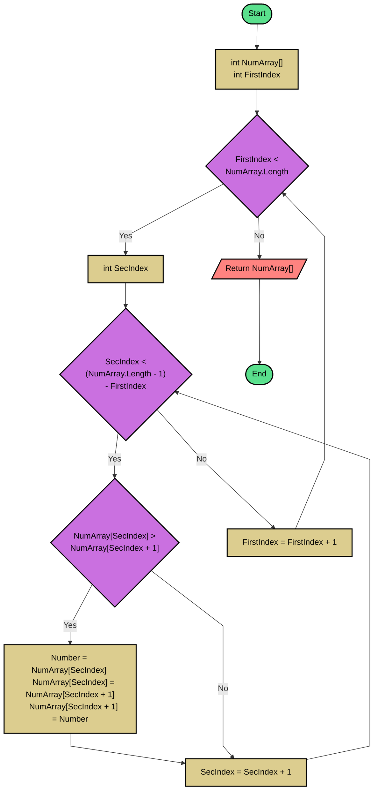

## Problem 2
This program will sort an array of integers in ascending order.

## Flowchart

## Pseudo code 
```basic
READ NumArray[]
FirstIndex = 0
WHILE FirstIndex < NumArray.Length
	SecIndex = 0
	WHILE SecIndex < (NumArray.Length - 1) - FirstIndex
		IF NumArray[SecIndex] > NumArray[SecIndex + 1]	
			Number = NumArray[SecIndex]
			NumArray[SecIndex] = NumArray[SecIndex + 1]
			NumArray[SecIndex + 1] = Number
		ENDIF
		SecIndex = SecIndex + 1
	ENDWHILE
   	FirstIndex = FirstIndex + 1
ENDWHILE
RETURN NumArray
```
## Source Code - C#
**[Click here](./Problem2.cs)** to see the implementation.


    
    