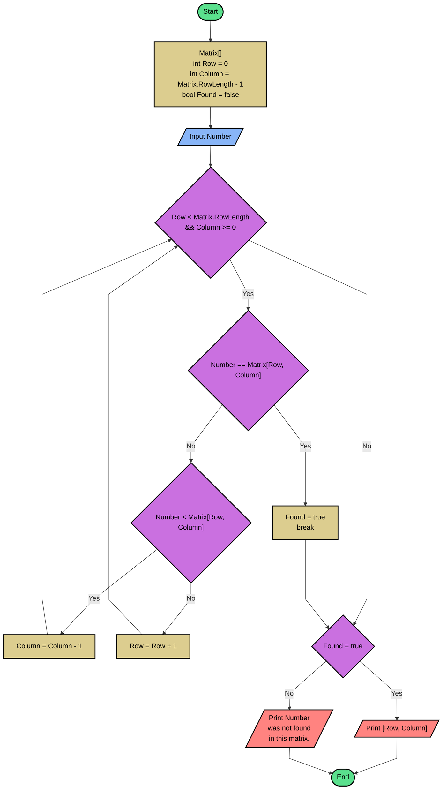

## Problem 3
This program will search a number in a sorted matrix and report the exact location of this number. 
If the number is not in the matrix will return the number was not found.

My first attempt in solve this challenge I passed one by one of the number until find the positions.
However the challenge description said there were more clever ways to solve, then I searched on the internet
and found a binary search algorithm. So, I applied this new way to my resolution.

## Flowchart

## Pseudo code
```basic
READ Matrix
READ Number
Row = 0
Column = Matrix.ColumnLength - 1
Found = false
WHILE Row < Matrix.RowLength
and Column >= 0
	IF Number = Matrix[Row, Column]	
		Found = true
		break
	ELSE
		IF Number < Matrix[Row, Column]
			Column = Column - 1
		ELSE
			Row = Row + 1
		ENDIF
	ENDIF
ENDWHILE
IF Found = true
	WRITE "Row, Column"
ELSE
	WRITE "The typed number was not found in this matrix."
ENDIF
```

