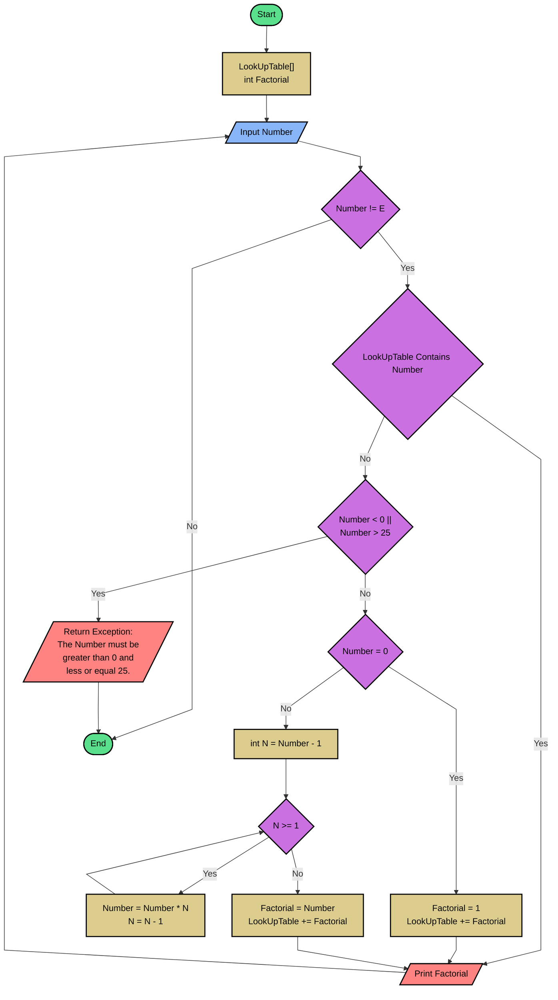

## Problem 4
This program will calculate the number of a factorial between 0 and 25, and
if the factorial have already calculated in the actual execution of the program it will 
return the factorial already calculated, without calculate it again.

Note, the limit of the numbers was limited until 25, because a greater number would overflow a variable of type long in C#. Using an integer this number would be less yet.

## Flowchart


## Pseudo code
```basic
READ LookUpTable
READ int Factorial
READ NumberInput
WHILE NumberInput!= "E"
	IF LookUpTable Contains NumberInput
		WRITE Factorial
	ELSE
		IF 	NumberInput < 0 or NumberInput > 25
			RETURN Exception "The NumberInput must be greater than 0 and less or equal 25"
		ENDIF
		IF NumberInput = 0
			int Factorial = 1
			LookUpTable += Factorial
		ELSE
			N = NumberInput - 1
			WHILE N >= 1
				NumberInput = NumberInput * N	
				N = N - 1
			ENDWHILE
		int Factorial = NumberInput
		ENDIF
	LookUpTable += Factorial
	WRITE Factorial
	READ NumberInput
ENDWHILE
```


