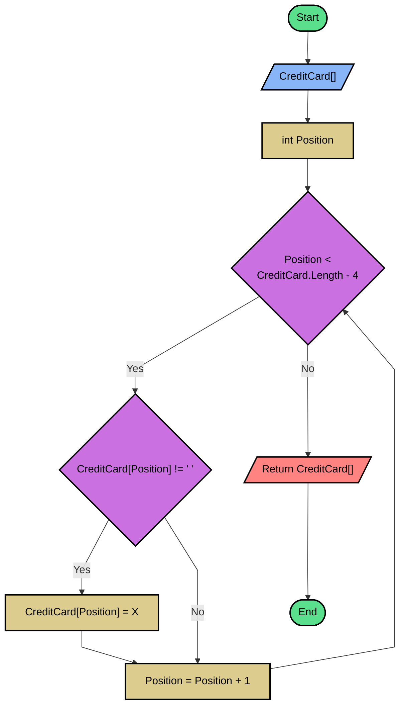

## Flowchart (second part) - Hide the first 12 digits



## Pseudo code
```basic
READ CreditCard
Position = 0
WHILE Position < CreditCard.Length - 4
	IF CreditCard[Position] != " "
		CreditCard[Position] = "X"
	ENDIF
	Position = Position + 1
ENDWHILE
RETURN CreditCard
```

## Source Code - C#
**[Click here](./Problem5.cs)** to see the implementation.