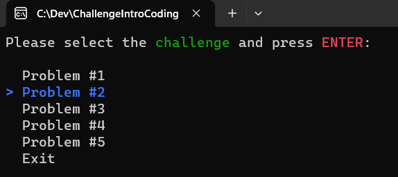

# Intro do Coding - Code First Girls

## Challenge

I'm taking some courses from **[Code First Girls](https://codefirstgirls.com/)**. This institution supports women who want to enter Tech. 

This project is a Challenge to the certificate course Intro to Coding. 
Were received a few problems to solve, produce the algorithm, and present the flowchart and pseudo code.

## My approach in solving the challenges
Even if the problem didn't ask to make the code, I developed code, flowchart, and pseudo-code for each one.
Also, was required to solve at least 2 problems, but I solved all five ones. 

Although as possible to enter a group to divide the problems, I decided to make everything by myself. 
The reason for that is that I wanted to practice each logical issue and focus  **100% coding in C#**.

I'm using C#, because I like to work with that. Since I've started to learn this language I'm enjoying each new learn, 
each new line of code. 

Of course, I'm just a beginner in coding, so I don't have enough knowledge to argue about whether one language is good or not, 
but I like the way C# works, the structure of the code, and its typing. As the methodic person that I am, I feel comfortable
with the ways the code is developed and presented in this language.

## Tooling
To make the flowcharts I used the tool called **[Mermaid](https://mermaid.js.org/syntax/flowchart.html)** and used the package called **[Spectre Console](https://spectreconsole.net/prompts/selection)** to make the **Menu**.

Follow, the way **Menu** is presented, using *Spectre Console* in *C#*.

### Running the code
Ensure that you have the [.NET SDK 6.0](https://dotnet.microsoft.com/en-us/download/dotnet/6.0) installed. Then, in a terminal, navigate to the [ChallengeIntroCoding](./ChallengeIntroCoding) directory, then run `dotnet build` and `dotnet run`.

## Solutions
To access directly the resolution of each problem (Code, Flowchart, Pseudo code), follow the:

**_[Problem 1 - Solved](./ChallengeIntroCoding/Problem1.md)_**

**_[Problem 2 - Solved](./ChallengeIntroCoding/Problem2.md)_**

**_[Problem 3 - Solved](./ChallengeIntroCoding/Problem3.md)_**

**_[Problem 4 - Solved](./ChallengeIntroCoding/Problem4.md)_**

**_[Problem 5 - Solved](./ChallengeIntroCoding/Problem5.md)_**

**_[Problem 5_1 - Solved](./ChallengeIntroCoding/Problem5_1.md)_**

**To facilitate understanding, Problem 5 was divided into two flowcharts and pseudo code*.